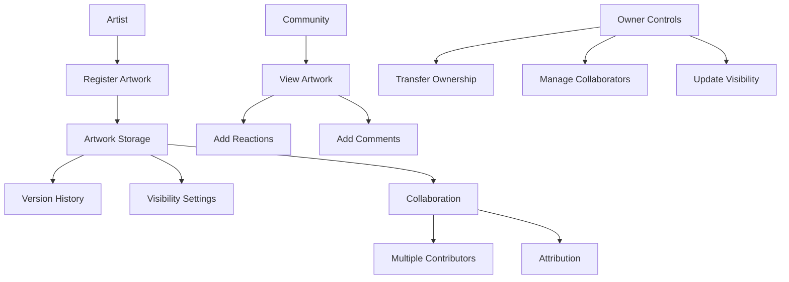

# Pixel Vault Art Platform

A decentralized platform for artists to store, share, and collaborate on digital artwork using the Stacks blockchain.

## Overview

Pixel Vault enables artists to:
- Store digital artwork metadata on-chain
- Maintain version history of their artwork
- Control artwork visibility (public/private/collaborative)
- Collaborate with other artists
- Engage with the community through comments and reactions
- Manage ownership and attribution rights

## Architecture

The platform is built on a single smart contract that manages all core functionality for digital artwork management and collaboration.



## Contract Documentation

### Core Features

1. **Artwork Management**
   - Registration of new artwork with metadata
   - Version history tracking
   - Visibility control (public/private/collaborative)

2. **Collaboration System**
   - Up to 10 collaborators per artwork
   - Clear attribution for contributions
   - Version tracking per contributor

3. **Community Engagement**
   - Reaction system
   - Commenting functionality
   - View controls based on visibility settings

4. **Ownership Controls**
   - Ownership transfer
   - Collaborator management
   - Access control based on roles

## Getting Started

### Prerequisites
- Clarinet
- Stacks wallet

### Basic Usage

1. **Register New Artwork**
```clarity
(contract-call? .pixel-vault register-artwork 
    "My Artwork" 
    "Description" 
    "ipfs://metadata-uri" 
    "public")
```

2. **Add New Version**
```clarity
(contract-call? .pixel-vault add-artwork-version 
    u1 
    "ipfs://new-version-uri" 
    "Updated colors")
```

3. **Add Collaborator**
```clarity
(contract-call? .pixel-vault add-collaborator 
    u1 
    'ST1PQHQKV0RJXZFY1DGX8MNSNYVE3VGZJSRTPGZGM)
```

## Function Reference

### Public Functions

#### Artwork Management
```clarity
(register-artwork (title (string-ascii 100)) 
                 (description (string-utf8 500))
                 (metadata-uri (string-ascii 256))
                 (visibility (string-ascii 20)))

(add-artwork-version (artwork-id uint)
                    (metadata-uri (string-ascii 256))
                    (change-description (string-utf8 200)))

(update-artwork-visibility (artwork-id uint) 
                         (visibility (string-ascii 20)))
```

#### Collaboration
```clarity
(add-collaborator (artwork-id uint) (collaborator principal))
(remove-collaborator (artwork-id uint) (collaborator principal))
(transfer-artwork (artwork-id uint) (new-owner principal))
```

#### Community Engagement
```clarity
(add-reaction (artwork-id uint) (reaction-type (string-ascii 20)))
(add-comment (artwork-id uint) (content (string-utf8 500)))
```

### Read-Only Functions
```clarity
(get-artwork (artwork-id uint))
(get-artwork-version (artwork-id uint) (version-id uint))
(can-view-artwork (artwork-id uint))
(get-all-artwork-versions (artwork-id uint))
(get-artwork-reaction-count (artwork-id uint))
```

## Development

### Testing
1. Clone the repository
2. Install Clarinet
3. Run tests:
```bash
clarinet test
```

### Local Development
1. Start Clarinet console:
```bash
clarinet console
```
2. Deploy contract:
```bash
(contract-call? .pixel-vault ...)
```

## Security Considerations

### Access Control
- Only artwork owners can:
  - Transfer ownership
  - Manage collaborators
  - Change visibility settings
- Collaborators can:
  - Add new versions
  - View private artwork
- Public can:
  - View public artwork
  - Add reactions and comments to visible artwork

### Limitations
- Maximum 10 collaborators per artwork
- Cannot delete artwork or versions
- Reactions cannot be removed once added
- File content stored off-chain (only metadata on-chain)

### Best Practices
- Verify ownership before transferring valuable artwork
- Use secure off-chain storage for artwork files
- Review collaborator permissions carefully
- Test visibility settings before sharing sensitive artwork